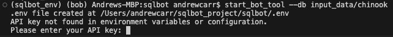
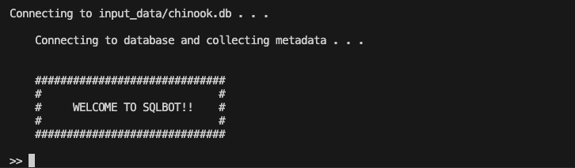
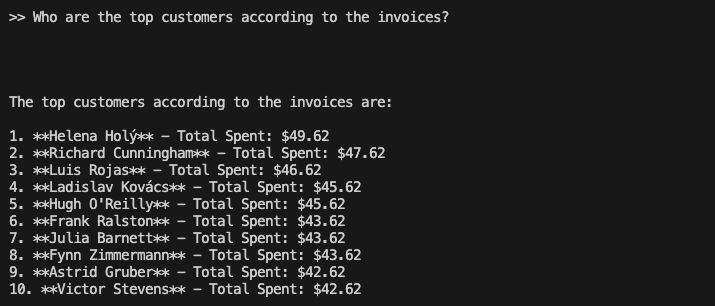
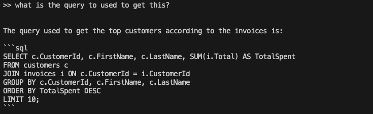

## sqlbot

sqlbot is an LLM chatbot that you can run from the command line. The bot is connected to a SQL database that the user specifies as a system parameter.

### Installation 

`pip install git+https://github.com/AndrewCarr24/sqlbot.git`

### Use 

To run from the command line, type `start_bot_tool --db [path to db]`. `[path to db]` should be replaced with the path to the database you want to run queries against. 

This repository includes an example database, the public Chinook database, which has information on album sales, including customers, artists, tracks, and invoices.

`start_bot_tool --db input_data/chinook`

When you first run this command, you will be asked for your OpenAI API key.

Enter your key and press Enter. The key will be saved in a .env file in the project directory for future use. After you enter your key, the sqlbot utility will start up.

This command line utility is a Langchain Chat Model connected to a tool to query the db. Upon launch, the tool automatically sends an initial prompt to the LLM to obtain metadata about the attached db. This metadata is used as a system prompt in subsequent queries. 

Here's an example of the tool in action - 

This agent has message history, so if you want the query used to get a result you can request it.

